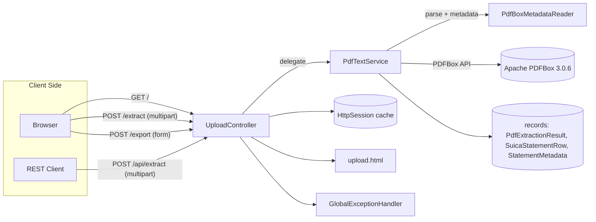

# Architecture

Technical deep dive into the Suica PDF Viewer service.

## Table of Contents
1. [System Overview](#system-overview)
2. [Component Diagram](#component-diagram)
3. [Modules & Responsibilities](#modules--responsibilities)
4. [Request & Data Flow](#request--data-flow)
5. [PDF Extraction Pipeline](#pdf-extraction-pipeline)
6. [Session Cache & CSV Export](#session-cache--csv-export)
7. [Database & Storage](#database--storage)
8. [External Integrations](#external-integrations)
9. [Design Decisions](#design-decisions)

## System Overview
The application is a single Spring Boot 3.5.x service structured along DDD layers (interfaces → application → domain → infrastructure). It accepts Suica statement PDFs through a browser or API client, parses text and metadata via Apache PDFBox, and renders results in Thymeleaf or JSON. State is minimal and stored in the `HttpSession` only long enough to back CSV export.

## Component Diagram

## Modules & Responsibilities
| Module | Key types | Responsibility |
| --- | --- | --- |
| `com.example.demo.interfaces.api` | `PdfUploadController`, `GlobalExceptionHandler`, `ErrorResponse` | Routes web/API requests, keeps controllers thin, and maps exceptions from other layers to HTTP responses.
| `com.example.demo.application.service` | `PdfTextService`, `CsvExportService` | Orchestrates use cases: PDF extraction, feature gating, CSV creation, and translation of validation failures into application exceptions.
| `com.example.demo.domain.model` / `.exception` | `PdfExtractionResult`, `PdfFeature`, `DomainException` hierarchy | Holds aggregates/records plus domain-specific error types free of technical dependencies.
| `com.example.demo.infrastructure` | `PdfBoxMetadataReader`, `PdfProcessingException` | Integrates with PDFBox/XMPBox and wraps technical failures.
| `src/main/resources/templates` | `upload.html` | Renders the upload form, feature toggles, metadata cards, result tables, and client-side pagination logic.
| `src/test/java` | `PdfTextServiceTest`, `CsvExportServiceTest`, `PdfUploadControllerApiTests`, `DemoApplicationTests` | Regression coverage for the parser, CSV export logic, API error mappings, and context bootstrap.

## Request & Data Flow
1. `GET /` populates Thymeleaf model attributes (`result`, `availableFeatures`, `selectedFeatures`) from the session or defaults.
2. `POST /extract` receives a multipart PDF and feature list. The controller calls `PdfTextService.extractText(MultipartFile, EnumSet)` and stores the returned `PdfExtractionResult` under two session keys (result + feature set). Errors are reported inline.
3. `POST /api/extract` mirrors the behavior but propagates exceptions to `GlobalExceptionHandler`, which serializes them into a consistent `ErrorResponse` payload (400 for domain validation, 422 for application rules, 500 for infrastructure failures).
4. `POST /export` calls `CsvExportService` to validate selections and emit CSV text; any validation exceptions likewise bubble to the global handler.

## PDF Extraction Pipeline
`PdfTextService` is stateless and performs the following per upload:
- Loads the PDF bytes with `Loader.loadPDF` and determines which feature buckets to populate via `EnumSet<PdfFeature>`.
- Runs `PDFTextStripper` over the entire document when metadata or raw text is needed. The stripper is tuned with tighter `averageCharTolerance`/`spacingTolerance` values to preserve Japanese tables.
- `extractMetadata` scans normalized lines for heading text, card numbers (`JE...` pattern), a "残高履歴" summary, and the first date string to convert to `LocalDate`.
- Table parsing leverages `PDFTextStripperByArea` with a detected header Y-position (`HeaderDetectingStripper`) so only the transaction grid is processed. Further heuristics drop headers/footers, attempt multiple tokenization strategies (tab, double-space, single-space), and normalize yen symbols.
- The service classifies rows via `SuicaStatementRow`, resolves month/year context from the heading timestamp, and normalizes currency tokens.
- When document metadata is requested, `PdfBoxMetadataReader` reads info dictionary fields and XMP metadata (Dublin Core + XMP Basic) before packaging everything into `PdfDocumentMetadata`.
- Input validation failures (missing files, unsupported formats, nonexistent paths) bubble up as domain exceptions so the interfaces layer can differentiate them from infrastructure outages.

## Session Cache & CSV Export
- The last `PdfExtractionResult` is stored under `LATEST_PDF_RESULT` and the last selected features under `LATEST_PDF_FEATURES` in the `HttpSession`.
- CSV export uses the cached rows, filters by the submitted `rowIds`, and writes a header plus escaped values (doubling quotes when necessary). Because the controller only keeps results in memory per session, there is no long-term persistence risk.

## Database & Storage
There is no database. Temporary state lives in memory, uploads are processed immediately, and reference PDFs reside on disk inside the `source/` directory strictly for local testing. Generated build artifacts stay under `build/`.

## External Integrations
- **Apache PDFBox / XMPBox**: Low-level parsing of text, layout, info dictionary, and XMP metadata.
- **Spring MVC Multipart**: Handles file uploads and session management.
- **Thymeleaf**: Server-side rendering of the dashboard view.
- **HTTP clients**: Any browser or multipart-capable REST client (e.g., `curl`, Postman) may invoke the endpoints.

## Design Decisions
- **Feature gating (`PdfFeature`)** avoids unnecessary parsing work and large payloads when consumers only need a subset of data.
- **Records for DTOs** simplify serialization (Jackson auto-detects them) and reduce boilerplate for the API.
- **Session-scoped caching** was chosen instead of persistence to keep the app stateless from an infrastructure perspective while still enabling CSV export.
- **No database** keeps the deployment light-weight; PDFBox does all heavy lifting in-memory.
